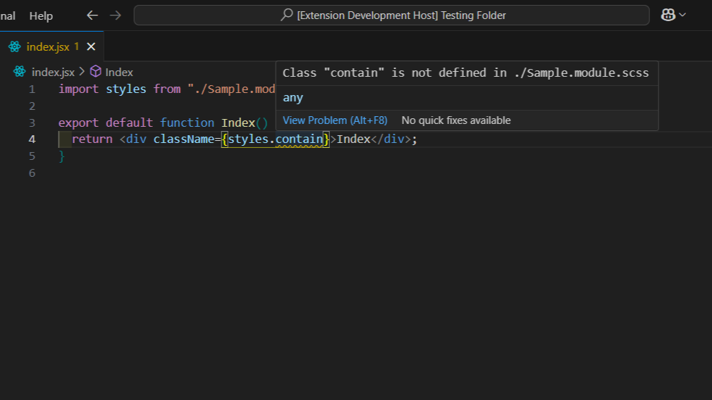
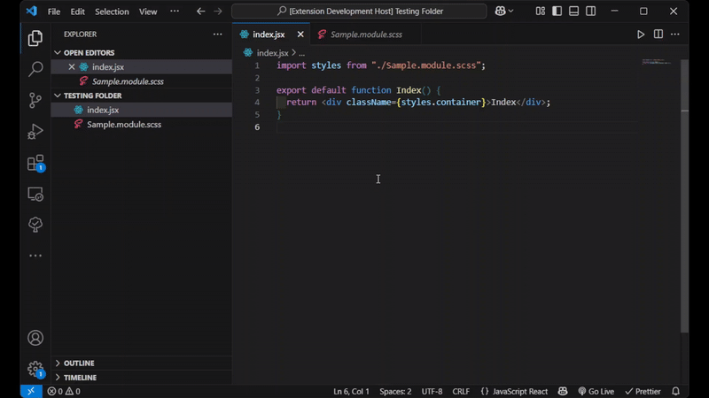

# CSS Modules Intellisense for VS Code

A lightweight Visual Studio Code extension that provides **linting**, **rename**,
and **navigation features** for projects using CSS Modules — including
`.module.css`, `.module.scss`, and `.module.less` files.

---

## ✨ Features

- ⚠️ **Linting**: Warns about undefined CSS module class names used
  in JS/TS/React files.

  

- ✏️ **Rename Support**: Refactor class names in CSS Modules and update all references.
- 🧭 **Go-to-Definition** Go-to-Definition for `styles.className`.
- 💡 **Autocomplete** Autocomplete suggestions for class names.

  

- 🛠️ **Supports SCSS & LESS** in addition to plain CSS.

---

## ✅ Supported File Types

- `.module.css`
- `.module.scss`
- `.module.less`
- `.js`, `.ts`, `.jsx`, `.tsx` using `import styles from './file.module.css'`

---

## 🚀 Getting Started

1. Install the extension from the Marketplace or via VSIX
2. Use `import styles from './file.module.css'` pattern
3. Hover, rename, or save to see linting feedback

---

## 📢 Feedback & Contributions

Feel free to open issues or PRs on
[GitHub](https://github.com/Lokesh-Garg-22/CSS-Modules-IntelliSense) —
suggestions and feedback are always welcome!

---

## 📄 License

This extension is licensed under the [MIT License](./LICENSE).
